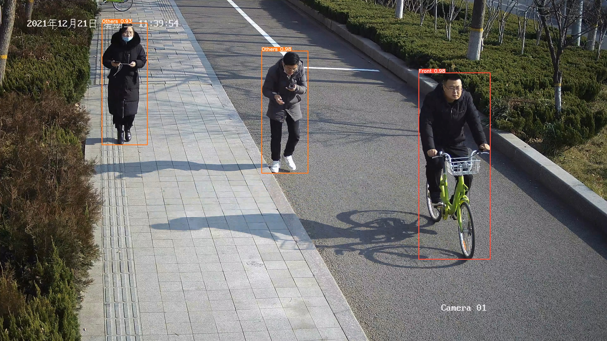
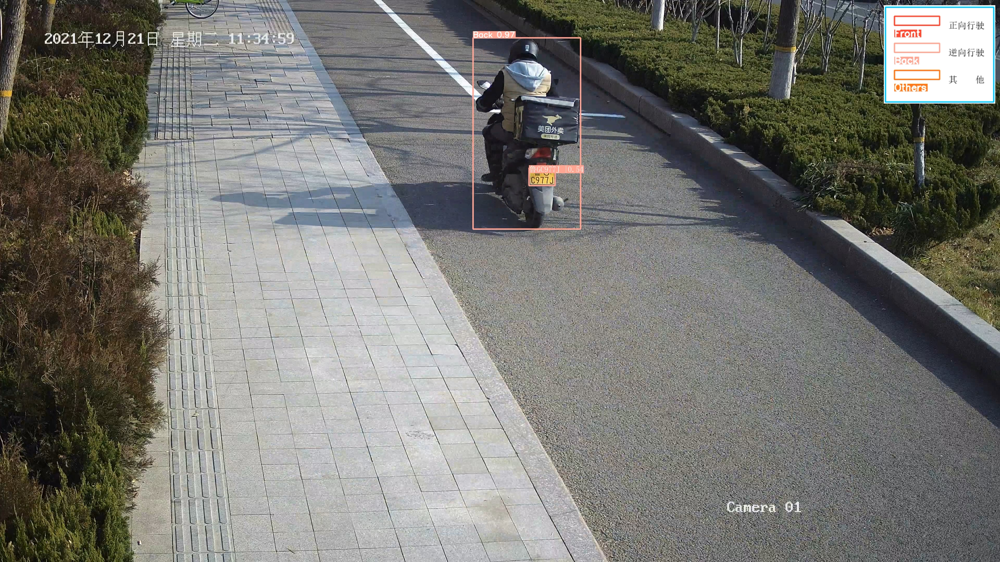

# A NonMotor violation detection project using yolov5 and deep-text-recognition-benchmark

yolo repo [yolov5](https://github.com/ultralytics/yolov5).
 
deep-text-recognition-benchmark repo [deep-text-recognition-benchmark](https://github.com/clovaai/deep-text-recognition-benchmark).
## Demo

no license plate

 

with license plate

 

This project was eventually used on NVIDIA Jetson Nano and accelerated with [tensorrt](https://github.com/NVIDIA/TensorRT).